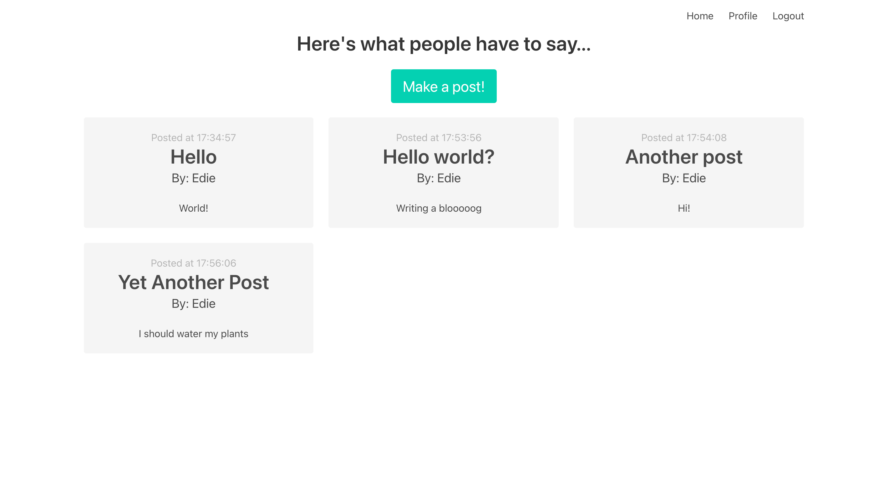
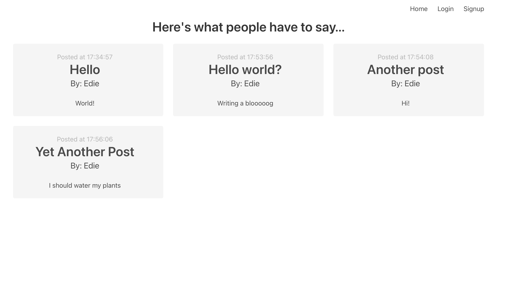
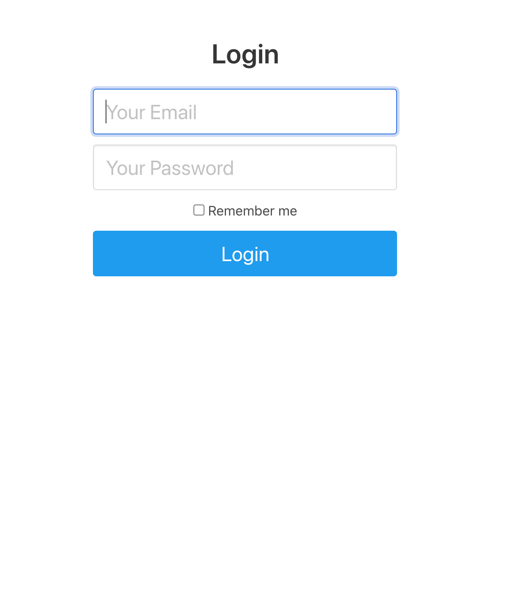
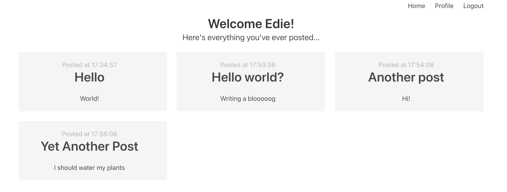
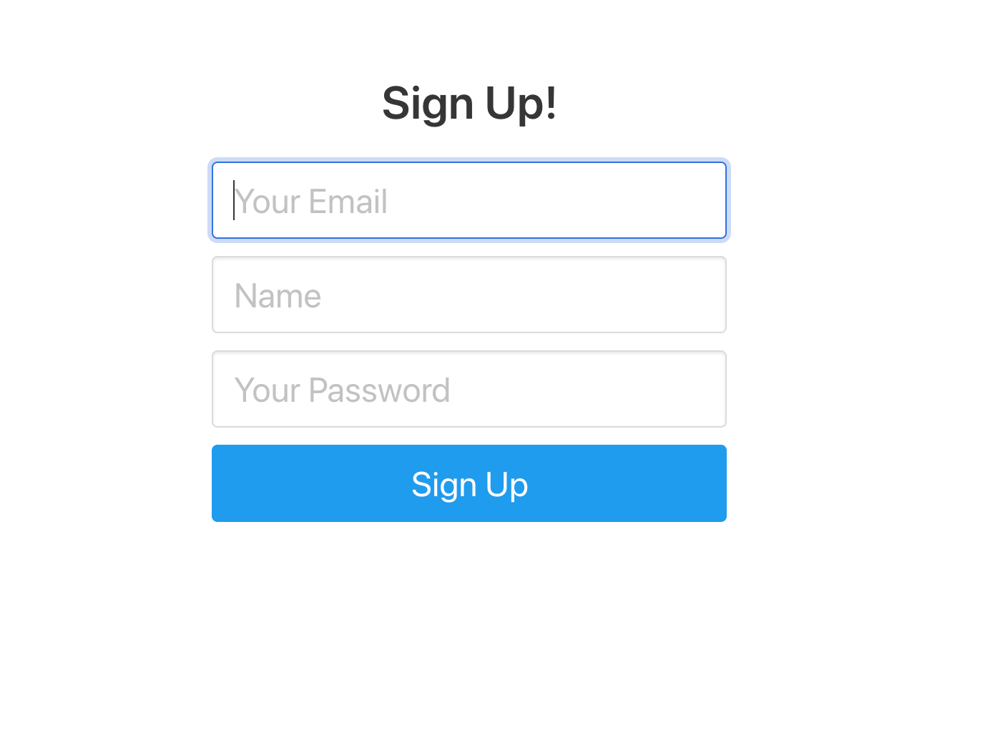

# Hack Technology / Project Attempted
Flask for REST API / templating for lightweight apps 

## What you built? 
A login flow, and a blog posting interface. Here are some screenshots!

Home page

Home page (logged out)

Login screen

User profile

Signup page

## Who Did What?
I worked alone

## What you learned
Flask is really awesome for whipping up a simple frontend or backend and interacting with a lightweight database. It's quick to learn, since python is a very familiar language; it was fun and rewarding to create the app. 

## Authors
Elizabeth (Edie) Wilson

## Acknowledgments
Followed [this tutorial](https://www.youtube.com/watch?v=K0vSCCAM2ss) for creating a flask application with authentication. 

